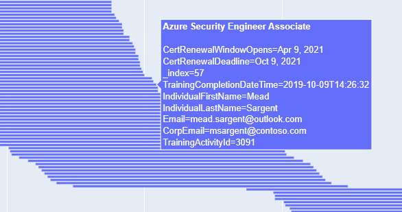

# Certification Renewal Report for Partners

In February 2021, Microsoft will introduce a new approach to help learners stay current with their certifications, please see the public announcement [here](https://aka.ms/CertRenewalBlog).

[Certification Renewal Report](https://aka.ms/certrenew) allows you to take the [Trainings report from Partner Center Insights](https://partner.microsoft.com/en-us/dashboard/partnerinsights/analytics/downloads?report=TrainingCompletions), and convert it into an overview of all the role-based and specialty certifications within your partner organisation. In addition, it will calculate the 6 month window during which a learner can renew their certifcation via a [free Microsoft Learn assessment](https://aka.ms/CertRenewalOverview).

## How to use - Downloading the raw data from Partner Center Insights

* If you're new to Partner Center Insights, please refer to [this documentation first.](https://docs.microsoft.com/en-us/partner-center/pci-download-reports)
* Browse to the [Partner Center Insights](https://partner.microsoft.com/en-us/dashboard/partnerinsights/analytics/downloads?report=TrainingCompletions)
* Select report type "Trainings", select timeframe "Lifetime", and select either File extension "TSV" or "CSV" (both formats are supported)
* Click the Generate button to create the report
* Download the .CSV/.TSV file via the link in the "Generated Reports" section
* The script requires that you have Python installed, which can be downloaded [here](https://www.python.org/downloads/)

## How to use - Running the script

* The script requires that you have Python installed, which can be downloaded [here](https://www.python.org/downloads/)
* Required modules: [Pandas](https://pandas.pydata.org/), [XlsxWriter](https://xlsxwriter.readthedocs.io/), [Tkinter](https://docs.python.org/3/library/tkinter.html), [Plotly, and Plotly Express](https://plotly.com/python/gantt/)
* Download/clone the script onto your local computer
* When running the .py script, a File Open dialog box should appear, allowing you to select the CSV/TSV file
* If the program is successful, two files will be generated in the current folder (where the script is executed)

An Excel spreadsheet summary with a summary of the certifications, and the key dates for renewal:

A Gantt chart, showing a visual representation of the certification renewal windows for the organisation:

Mousing-over the individual certification will expose additional detail:

## Please note

* This is not an official Microsoft tool, and is maintained in my spare time
* The 'CertRenewalWindowOpens' and 'CertRenewalDeadline' columns are calculated based on rules, and are not derived via API, so please do not treat these as authoratative
* If you need to check the actual dates, please refer to the learner's MCP Transcript, or their public YourAcclaim page

## Feedback

*  Reach me on Twitter [@guygregory](https://twitter.com/guygregory)
